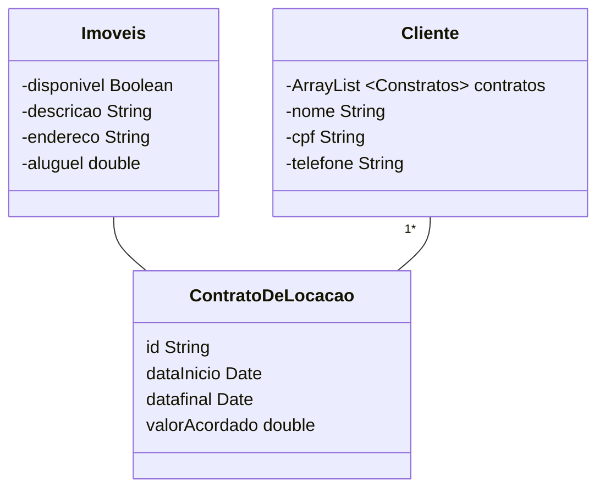

```mermaid
classDiagram
    
    Imoveis -- ContratoDeLocacao
    Cliente "1*"-- ContratoDeLocacao

    
    class Imoveis{
        -disponivel Boolean 
        -descricao String
        -endereco String
        -aluguel double
    }
    
    class Cliente{
        -ArrayList ~Constratos~ contratos
        -nome String
        -cpf String
        -telefone String
    }
    
    class ContratoDeLocacao{
        id String
        dataInicio Date
        datafinal Date
        valorAcordado double
        
    }
    


```